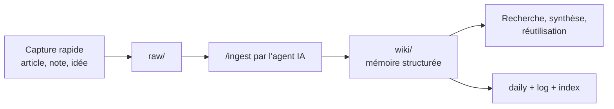

# 00 - Description de la mémoire numérique

> **Résumé en une phrase** : Une mémoire numérique est un dossier de fichiers Markdown structuré, consultable dans Obsidian, enrichi par un agent IA et entretenu comme un système de connaissance vivant.

## C'est quoi, en termes simples ?

Une mémoire numérique est un espace où l'on garde les idées, sources, décisions, projets, notes rapides et apprentissages sous forme de fichiers texte lisibles. Le contenu réside dans un dossier sur un ordinateur, ce qui le rend portable et durable.

Obsidian sert à lire et visualiser cette mémoire. L'agent IA sert à l'écrire proprement : il transforme les captures brutes en notes structurées, ajoute des liens, maintient l'index, journalise les changements et garde la trace des sources.

## Ce que ça permet

- Retrouver une décision prise il y a plusieurs semaines.
- Transformer une idée prise rapidement au téléphone en note reliée à un projet.
- Construire une base de connaissances personnelle ou d'équipe.
- Produire des articles, posts LinkedIn, synthèses ou plans à partir de sources accumulées.
- Garder une trace des projets actifs, décisions, questions ouvertes et ressources.
- Alimenter un agent IA avec un contexte beaucoup plus précis qu'une conversation vide.

## Exemple simple

## Rôle des outils

| Outil ou couche | Rôle |
| --- | --- |
| Obsidian | Lire, visualiser, chercher et naviguer dans les notes |
| Agent IA | Écrire la mémoire structurée, relier, synthétiser, maintenir la cohérence |
| AIOS | Expliquer à l'agent qui utilise le vault, quelles règles suivre et où écrire |
| Skills | Automatiser les gestes répétables : `/prime`, `/ingest`, `/save`, `/query`, `/lint` |
| Web Clipper | Capturer le web en Markdown propre vers `raw/clippings/` |
| Service de synchronisation | Optionnel mais fortement utile pour retrouver le vault sur plusieurs appareils |

Un service de synchronisation n'est pas obligatoire pour faire fonctionner le kit. Il devient très utile si l'on veut utiliser la mémoire sur plusieurs machines ou capturer depuis différents appareils. OneDrive est un exemple, mais d'autres options existent : iCloud Drive, Dropbox, Syncthing ou Git.

## Coûts et tokens

Une mémoire numérique n'est pas gratuite à utiliser avec l'IA. Quand l'agent lit des notes, résume des sources ou maintient le contexte, il consomme des tokens. Selon l'outil et le modèle, ces tokens peuvent compter dans un quota d'abonnement ou être facturés à l'usage.

Pour garder les coûts sous contrôle :

- ne pas charger tout le vault ;
- commencer par `wiki/index.md` ;
- garder les notes atomiques ;
- utiliser de petits modèles pour les tâches simples ;
- réserver les gros modèles aux décisions, synthèses difficiles ou refontes.

## Limites pratiques

La mémoire réside sur un Mac ou un PC. Si l'ordinateur est fermé, en veille profonde, hors réseau ou si le service de synchronisation n'a pas fini son travail, certaines actions ne seront pas disponibles.

Les automatismes horodatés ont la même limite : si l'ordinateur qui les exécute est fermé ou déconnecté, ils ne tournent pas. Pour des automatismes critiques, il faut envisager un ordinateur local toujours disponible ou une exécution dans le nuage.

## Sources

- [Obsidian — Data storage](https://help.obsidian.md/data-storage)
- [Obsidian — Create a vault](https://help.obsidian.md/vault)
- [Obsidian — Sync notes](https://help.obsidian.md/sync-notes)
- [Obsidian Web Clipper](https://help.obsidian.md/web-clipper)
- [OpenAI — Pricing](https://platform.openai.com/docs/pricing/)

## Liens typés

- fait-partie-de → [[Fonctionnement-complet-du-vault-Obsidian-AIOS]]
- soutient → [[03-Architecture-du-vault]]
- soutient → [[06-Ingest-raw-vers-wiki]]
- soutient → [[12-Choix-des-modeles-IA]]
- rédigé-par → humain+claude
