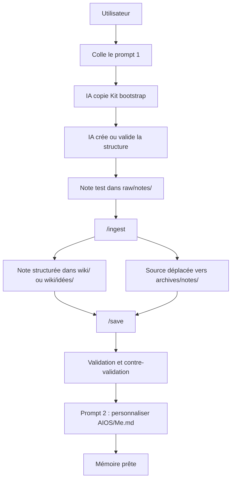

# 02 - Comment mettre en place votre mémoire numérique

> **Résumé en une phrase** : La mise en place consiste à installer Obsidian et un outil IA, créer un dossier de travail, copier le Kit bootstrap générique, puis laisser l'IA valider et tester la mémoire numérique.

## L'idée simple

Une mémoire numérique est un dossier bien organisé que l'IA aide à maintenir.

Vous n'avez pas besoin de comprendre toute la mécanique au départ. Le principe est :

1. Installer les outils de base.
2. Créer un dossier pour la mémoire.
3. Télécharger et décompresser [`kit-bootstrap.zip`](kit-bootstrap.zip), ou cloner ce repo.
4. Coller le prompt de mise en place.
5. Laisser l'IA copier les gabarits, remplacer les placeholders, valider et tester.
6. Ouvrir le résultat dans Obsidian pour le lire et le valider visuellement.

## Les mots à connaître

| Mot | Explication simple |
| --- | --- |
| Vault | Le dossier principal de votre mémoire numérique |
| Obsidian | L'application qui permet de lire, naviguer et visualiser les notes |
| Outil IA | L'assistant qui crée, classe, relie et entretient les notes |
| `raw/` | La boîte d'entrée : idées, captures web, notes rapides, documents à traiter |
| `wiki/` | La mémoire structurée : notes propres, liées et réutilisables |
| `wiki/idées/` | Les idées devenues réutilisables, reliées aux projets et aux autres idées |
| `archives/` | Les sources déjà traitées, gardées pour la traçabilité |
| `AIOS/` | Le mode d'emploi que l'IA lit pour comprendre le fonctionnement du vault |
| `skills/` | Les routines que l'IA suit, comme `/prime`, `/ingest` et `/save` |
| `Kit bootstrap/` | Les fichiers génériques à copier pour créer une mémoire prête à tester |

## Rôle des répertoires

| Répertoire | À quoi il sert | Qui écrit dedans |
| --- | --- | --- |
| `raw/` | Recevoir ce qui arrive vite : notes rapides, pages web, documents, idées pas encore classées | L'utilisateur, Obsidian, Web Clipper ou une automatisation |
| `wiki/` | Conserver la mémoire structurée : notes propres, reliées, datées et maintenues | L'agent IA |
| `wiki/idées/` | Conserver les idées détectées ou formulées pendant `/ingest` | L'agent IA |
| `archives/` | Garder les sources brutes déjà traitées pour pouvoir retracer l'origine d'une note | L'agent IA après `/ingest` |
| `AIOS/` | Donner à l'agent IA les règles, cartes et modes d'emploi du vault | L'agent IA, avec prudence |
| `skills/` | Documenter les routines réutilisables et les outils spécialisés | L'agent IA ou une personne technique |

La règle simple : l'utilisateur capture dans `raw/`, l'IA structure dans `wiki/`, puis les sources traitées vont dans `archives/`.

## Checklist rapide

- Installer Obsidian.
- Installer au moins un outil IA : Claude Code, Codex, Gemini CLI ou OpenCode.
- Créer un dossier vide pour votre mémoire numérique.
- Télécharger [`kit-bootstrap.zip`](kit-bootstrap.zip) et le décompresser, ou cloner ce repo pour avoir accès au dossier `Kit bootstrap/`.
- Ouvrir le dossier vide avec votre outil IA.
- Coller le prompt 1 ci-dessous.
- Lire le rapport de validation produit par l'IA.
- Si les tests passent, coller le prompt 2 pour personnaliser `AIOS/Me.md`.
- Ouvrir le dossier dans Obsidian et vérifier que les notes s'affichent bien.

## Ce que l'utilisateur doit faire, et seulement ça

L'utilisateur n'a pas à créer manuellement tous les dossiers et toutes les règles.

Son rôle est de :

1. Installer les outils.
2. Choisir ou créer le dossier du vault.
3. Donner accès au dossier `Kit bootstrap/`.
4. Ouvrir le dossier du vault avec l'outil IA.
5. Coller le prompt de mise en place.
6. Répondre aux questions de l'IA si elle en pose.
7. Valider dans Obsidian que les notes sont lisibles.

Le reste doit être fait par l'IA : copie du kit, structure, règles, notes AIOS, skills, test d'ingestion, sauvegarde et contre-validation.

## Prompt 1 - Installer le kit générique

Copier le bloc ci-dessous dans Claude Code, Codex, Gemini CLI, OpenCode ou un autre agent IA capable de lire et modifier un dossier local.

```text
Tu dois mettre en place une mémoire numérique Obsidian maintenue par IA dans le dossier courant.

Tu as accès à un dossier source nommé "Kit bootstrap". Ce kit est générique et contient les fichiers de départ à copier dans le nouveau vault. Ne réécris pas librement ces fichiers. Copie-les, puis adapte seulement les placeholders explicitement marqués.

Objectif final :
- créer un vault Markdown lisible dans Obsidian ;
- installer la logique AIOS à partir du Kit bootstrap ;
- créer ou valider raw/, wiki/, wiki/idées/, archives/, AIOS/ et skills/ ;
- tester le cycle raw/ -> /ingest -> wiki/idées/ ou wiki/ -> archives/ -> /save ;
- produire une validation et une contre-validation avant de déclarer le vault prêt.

Règles absolues :
- ne jamais écrire de secrets, clés API, jetons, mots de passe ou informations d'authentification dans le vault ;
- ne jamais supprimer une note structurée : si elle n'est plus active, utiliser status: archive ;
- ne jamais modifier le contenu d'un fichier dans raw/ ;
- exception : après un /ingest réussi, déplacer la source traitée de raw/ vers archives/ ;
- ne jamais inventer d'information absente du vault ;
- si une information manque, l'écrire clairement dans le rapport ;
- préserver les notes existantes si le dossier courant n'est pas vide.

Étapes obligatoires :
1. Inspecter le dossier courant et produire une section "État initial".
2. Copier les fichiers du Kit bootstrap vers le nouveau vault :
   - AGENTS.md
   - CLAUDE.md
   - AIOS/Me.md
   - AIOS/Vault Map.md
   - AIOS/Note Types.md
   - AIOS/Edge Types.md
   - AIOS/Skills Map.md
   - AIOS/Codex Config.md
   - skills/README.md
   - skills/prime.md
   - skills/ingest.md
   - skills/save.md
   - skills/query.md
   - skills/lint.md
   - skills/analyse/SKILL.md
   - skills/obsidian-markdown/SKILL.md
   - skills/json-canvas/SKILL.md
3. Créer les dossiers manquants :
   - raw/notes/
   - raw/clippings/
   - raw/docs/
   - wiki/Daily/
   - wiki/Ressources/
   - wiki/Intelligence/
   - wiki/Projets/
   - wiki/idées/
   - archives/notes/
   - archives/clippings/
   - archives/docs/
4. Remplacer uniquement les placeholders connus, si l'utilisateur donne l'information :
   - <NOM>
   - <RÔLE>
   - <LOCALISATION>
   - <LANGUE>
   - <DOMAINES>
   - <PROJETS_ACTIFS>
   - <OBJECTIFS>
   - <PRÉFÉRENCES_DE_TRAVAIL>
   - <CONTRAINTES>
   - <OUTILS>
5. Ne pas inventer les placeholders non fournis. Les laisser dans AIOS/Me.md ou les placer dans une section "À valider".
6. Créer ou valider les notes de base :
   - wiki/index.md
   - wiki/log.md
   - wiki/Daily/YYYY-MM-DD.md
   - wiki/Ressources/index.md
7. Vérifier que AIOS/Note Types.md contient les 16 types de notes.
8. Vérifier que AIOS/Edge Types.md contient les 10 liens typés.
9. Vérifier que les skills essentiels /prime, /ingest, /save, /query et /lint sont documentés.

Test obligatoire de bout en bout :
1. Créer une source test dans raw/notes/ avec une idée fictive.
2. Exécuter le comportement /ingest sur cette source.
3. Créer une note structurée dans wiki/idées/ si la source est une idée.
4. Ajouter frontmatter, résumé en une phrase et section "## Liens typés".
5. Ajouter au moins :
   - dérivé-de -> [[archives/notes/<source-test>.md]]
   - lié-à -> [[wiki/Projets]]
   - rédigé-par -> humain+ia
6. Déplacer la source test vers archives/notes/.
7. Mettre à jour wiki/index.md, wiki/Daily/YYYY-MM-DD.md et wiki/log.md.
8. Exécuter le comportement /save.
9. Vérifier que raw/ ne contient plus la source test.
10. Copier les skills essentiels dans ~/.claude/commands/ :                   
   - skills/prime.md → ~/.claude/commands/prime.md       
   - skills/ingest.md → ~/.claude/commands/ingest.md                         
   - skills/save.md → ~/.claude/commands/save.md         
   - skills/query.md → ~/.claude/commands/query.md                           
   - skills/lint.md → ~/.claude/commands/lint.md  

Validation obligatoire :
- dossiers requis présents ;
- fichiers du Kit bootstrap copiés ;
- AIOS/Me.md existe ;
- AIOS/Vault Map.md existe ;
- AIOS/Skills Map.md existe ;
- AIOS/Note Types.md contient les 16 types ;
- AIOS/Edge Types.md contient les 10 liens typés ;
- skills essentiels présents ;
- wiki/index.md existe ;
- wiki/log.md existe et a seulement reçu des ajouts ;
- daily du jour existe ;
- source test déplacée dans archives/notes/ ;
- note test créée dans wiki/idées/ ou wiki/ ;
- note test contient frontmatter, résumé et "## Liens typés" ;
- aucun secret détecté.
- skills essentiels présents dans ~/.claude/commands/                         
- /prime, /ingest, /save, /query et /lint disponibles dans Claude Code

Contre-validation obligatoire :
- relire le vault comme un auditeur sévère ;
- produire une section "Écarts trouvés" ;
- classer chaque écart : bloquant, important ou mineur ;
- corriger tous les écarts bloquants et importants ;
- relancer la validation ;
- ne pas déclarer le vault fonctionnel tant que la validation et la contre-validation ne passent pas.

Rapport final attendu :
- résumé de ce qui a été créé ;
- liste des fichiers copiés depuis le Kit bootstrap ;
- résultat du test /ingest ;
- résultat du test /save ;
- résultat de validation ;
- résultat de contre-validation ;
- prochaines actions recommandées pour l'utilisateur.
```
## Important - quitter et relancer claude code pour que les skills sont activés. 

## Prompt 2 - Personnaliser `AIOS/Me.md`

Utiliser ce second prompt seulement après la réussite des tests du prompt 1.

```text
Les tests du vault sont réussis. Maintenant, aide-moi à personnaliser AIOS/Me.md.

Pose-moi des questions pour en apprendre plus sur moi, mon rôle, mes projets, mes objectifs, mes préférences de travail, mes contraintes, mes outils et ma façon de penser.

Procède en entrevue guidée :
- pose 1 question à la fois ;
- commence par les informations essentielles ;
- évite les questions trop abstraites ;
- reformule mes réponses si elles sont ambiguës ;
- demande confirmation avant d'écrire une information importante dans AIOS/Me.md ;
- ne note jamais de secrets, mots de passe, clés API, jetons ou informations sensibles inutiles ;
- si une information est incertaine, ajoute-la dans une section "À valider" ;
- quand tu as assez d'information, mets à jour AIOS/Me.md ;
- respecte le format Markdown du vault ;
- conserve un résumé en une phrase ;
- termine avec un court résumé de ce que tu as ajouté ou modifié.
- si des projets ont été mentionné, fais un répertoire par projet dans wiki/projet/(nom du projet) avec une note à l'intérieur pour ce projet.

Commence maintenant par me poser les premières questions.
```

## Guide détaillé

### 1. Installer Obsidian

Obsidian sert à lire et explorer la mémoire. Il permet de voir les liens entre les notes, de naviguer dans les dossiers et de valider le rendu Markdown.

Il ne remplace pas l'agent IA pour la structure durable de la mémoire.

### 2. Installer un outil IA

Un seul outil IA suffit pour commencer. Les options possibles sont documentées dans [[01-Requis]].

L'outil IA doit pouvoir travailler dans un dossier local, lire les fichiers Markdown et créer ou modifier des notes.

### 3. Créer le dossier du vault

Créer un dossier vide, par exemple :

```text
Memoire-numerique/
```

Ce dossier deviendra le vault Obsidian.

### 4. Rendre le Kit bootstrap accessible

**Option rapide** : télécharger [`kit-bootstrap.zip`](kit-bootstrap.zip) depuis ce repo et le décompresser à côté du dossier du nouveau vault.

**Option complète** : cloner ce repo en entier — le dossier `Kit bootstrap/` s'y trouve déjà.

L'important est que l'IA puisse lire les fichiers du kit et les copier dans le nouveau vault.

### 5. Ouvrir le dossier avec l'outil IA

Lancer l'outil IA dans le dossier du nouveau vault. L'objectif est que l'IA voie ce dossier comme son espace de travail.

### 6. Coller le prompt 1

Coller le prompt de mise en place et laisser l'IA travailler.

L'IA doit copier le kit, créer la structure, valider les règles, lancer le test d'ingestion, exécuter `/save`, puis se relire comme auditeur.

### 7. Coller le prompt 2

Quand les tests sont réussis, coller le prompt 2 pour personnaliser `AIOS/Me.md`.

Cette étape transforme le gabarit générique en profil utile pour l'utilisateur, sans y mettre de secrets.

### 8. Ouvrir dans Obsidian

Ouvrir le dossier comme vault Obsidian.

Valider visuellement :

- les notes s'affichent ;
- les liens fonctionnent ;
- les dossiers sont compréhensibles ;
- la note `wiki/index.md` sert de point d'entrée.

## Ce qui est optionnel mais utile

| Élément | Pourquoi c'est utile |
| --- | --- |
| Service de synchronisation | Accéder à la mémoire sur plusieurs appareils |
| Obsidian Web Clipper | Capturer des pages web propres dans `raw/clippings/` |
| Notes Rapides | Capturer une idée sans ralentir le travail |
| Automatisations | Déposer automatiquement des sources dans `raw/` |
| Sauvegarde périodique | Pouvoir récupérer la mémoire en cas d'erreur ou de bris |

## Erreurs à éviter

- Modifier directement les notes structurées dans `wiki/` sans passer par l'IA.
- Effacer manuellement un projet ou un sujet dans `wiki/`.
- Laisser des sources traitées dans `raw/`.
- Mettre des secrets dans le vault.
- Croire que la synchronisation remplace une sauvegarde.
- Déclarer la mémoire prête sans test d'ingestion et contre-validation.

## Test final attendu



## Liens typés

- fait-partie-de → [[Fonctionnement-complet-du-vault-Obsidian-AIOS]]
- précédé-par → [[01-Requis]]
- suivi-par → [[03-Architecture-du-vault]]
- soutient → [[04-AIOS-et-regles-de-fonctionnement]]
- soutient → [[06-Ingest-raw-vers-wiki]]
- soutient → [[11-Entretien-de-la-memoire-numerique]]
- rédigé-par → humain+claude
