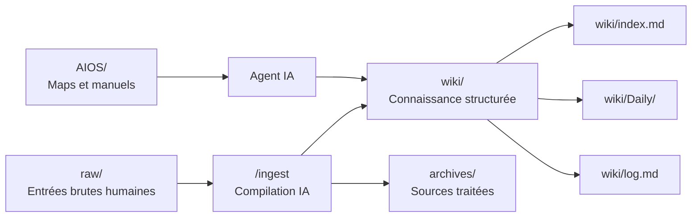

# 03 - Architecture du vault

> **Résumé en une phrase** : Le vault est organisé en couches distinctes où `raw/` reçoit les sources, `wiki/` contient la connaissance structurée, `archives/` garde la traçabilité et `AIOS/` guide les agents.

## Architecture logique

## Dossiers racine

| Dossier | Rôle | Règle |
| --- | --- | --- |
| `raw/` | Sources brutes déposées par le propriétaire du vault ou par des automatisations | Lire seulement, puis déplacer vers `archives/` après ingest réussi |
| `wiki/` | Notes structurées, synthèses, projets, idées, ressources et daily notes | Maintenu par l'agent selon Infinite Brain |
| `archives/` | Miroir des sources traitées | Ne pas modifier le contenu archivé |
| `AIOS/` | Couche portable de contexte et de règles | Lire en début de session |
| `skills/` | Slash commands et workflows locaux historiques | Sert de documentation et de source de commandes |
| `.claude/` | Règles et skills Claude Code | Source technique pour comportement Claude |
| `.agents/` | Skills disponibles pour agents compatibles | Source technique pour Obsidian, Defuddle, Bases, Canvas |

## Rôle des composantes majeures

| Composante | Rôle principal | À ne pas confondre avec |
| --- | --- | --- |
| Obsidian | Interface de lecture, navigation, recherche, graphe, backlinks, validation visuelle et capture brute | Outil principal d'écriture structurée dans `wiki/` |
| Service de synchronisation, ex. OneDrive | Synchronisation multi-appareils du dossier vault, optionnelle mais fortement utile | Moteur de connaissance ou outil de classement |
| Agent IA | Interface d'écriture structurée de la mémoire numérique ; maintient notes, liens, index, log, daily et archives | Simple éditeur de texte |
| AIOS | Contexte portable, règles et mode d'emploi pour agents IA | Contenu métier à ingérer |
| Skills | Processus répétables : `/prime`, `/ingest`, `/save`, `/query`, `/lint`, `/analyse` | Notes de fond du wiki |
| Obsidian Web Clipper | Capture web propre vers `raw/clippings/` | Classement final dans `wiki/` |
| `raw/` | Zone d'entrée et de capture brute | Mémoire numérique structurée |
| `wiki/` | Mémoire numérique structurée | Zone de brouillon libre |
| `archives/` | Traçabilité des sources traitées | Corbeille ou dossier de travail |
| `wiki/index.md`, `wiki/log.md`, `wiki/Daily/` | Mémoire opérationnelle : navigation, historique et sessions | Notes optionnelles |

## Rôle d'Obsidian et du service de synchronisation

Obsidian visualise le vault Markdown. Il permet de lire les notes, suivre les backlinks, explorer le graphe, chercher rapidement et valider le rendu. Il peut aussi servir à capturer des notes dans les zones d'entrée comme `raw/notes/`.

Un service de synchronisation, par exemple OneDrive, iCloud, Dropbox, Syncthing ou Git, peut rendre le même dossier Markdown disponible sur plusieurs appareils. Il est optionnel, mais fortement utile. Il ne maintient pas les règles AIOS, les liens typés, les daily notes ou le log.

L'agent IA est responsable de l'écriture structurée dans `wiki/`, car lui seul applique ensemble les conventions de mémoire numérique : frontmatter, types, liens, index, log, daily et archivage.

## Structure de `raw/`

| Dossier | Usage |
| --- | --- |
| `raw/clippings/` | Articles web, transcriptions, sorties d'automatisations, veille |
| `raw/docs/` | Documents plus lourds, PDFs, exports ou lots datés |
| `raw/notes/` | Notes rapides et captures personnelles |

`raw/` n'est pas un espace de rédaction. Si une information doit devenir durable, elle passe par `/ingest`.

## Structure de `wiki/`

| Dossier | Usage |
| --- | --- |
| `wiki/Context/` | Profil, business, objectifs, projets et contexte durable |
| `wiki/Intelligence/` | Recherches, concepts, analyses et signaux IA |
| `wiki/Projets/` | Notes détaillées par projet |
| `wiki/Resources/` | Guides, méthodes, ressources réutilisables |
| `wiki/idées/` | Idées capturées pendant `/ingest`, reliées aux projets ou à d'autres idées |
| `wiki/Daily/` | Journal de session par date |
| `wiki/Veilles-AI/` | Exemple de dossier de destination pour des veilles ingérées |
| `wiki/Contacts/` | CRM léger |
| `wiki/Achats/`, `wiki/Voyages/`, `wiki/posts-LinkedIn/` | Domaines de travail spécialisés |

## Fichiers de navigation

| Fichier | Fonction |
| --- | --- |
| `wiki/index.md` | Panneau de direction principal |
| `wiki/log.md` | Journal append-only des opérations |
| `Inbox.md` | Capture des idées ou informations non classées |
| `CLAUDE.md` | Règles opérationnelles principales |
| `AGENTS.md` | Règles équivalentes pour agents génériques |

## Ce qui ne doit pas arriver

- Créer une note sans lien typé.
- Déposer une synthèse finale dans `raw/`.
- Laisser une source traitée dans `raw/` après un ingest réussi.
- Modifier directement `wiki/` dans Obsidian comme workflow normal.
- Créer une documentation durable hors `wiki/` sauf si c'est une règle système comme `CLAUDE.md`.

## Liens typés

- fait-partie-de → [[Fonctionnement complet du vault Obsidian + AIOS]]
- soutient → [[AIOS/Vault Map]]
- soutient → [[Obsidian-Claude Code]]
- rédigé-par → humain+claude
