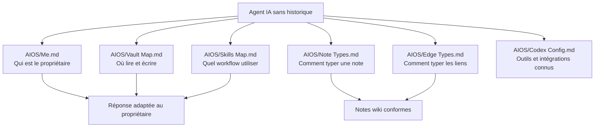

# 04 - AIOS et règles de fonctionnement

> **Résumé en une phrase** : AIOS est la couche portable qui explique à tout agent qui est le propriétaire du vault, comment naviguer dans le vault, quels processus utiliser et comment structurer les notes.

## Rôle d'AIOS

AIOS sert à rendre le vault lisible par n'importe quel agent IA sans dépendre de la mémoire d'une conversation précédente. C'est la couche "mode d'emploi" du vault.



## Fichiers AIOS

| Fichier | Ce qu'il contient | Quand le lire |
| --- | --- | --- |
| `AIOS/Me.md` | Identité, préférences, projets actifs, manière de travailler avec le propriétaire du vault | Début de session |
| `AIOS/Vault Map.md` | Architecture du vault, conventions de note, règles de navigation | Avant tout travail dans le vault |
| `AIOS/Skills Map.md` | Decision tree et description des workflows | Avant d'utiliser `/prime`, `/ingest`, `/save`, `/query`, `/lint` |
| `AIOS/Note Types.md` | Les 16 types de notes Infinite Brain en français | À chaque création de note |
| `AIOS/Edge Types.md` | Les 10 types de liens typés | À chaque ajout de section `## Liens typés` |
| `AIOS/Codex Config.md` | Configuration portable Codex et outils externes | Si la tâche touche une automatisation, un connecteur ou un serveur MCP |
| `AIOS/Migration Status.md` | État de migration Infinite Brain | Si on travaille sur la conformité du vault |

## Règles de comportement

- Répondre en français avec accents.
- Être concis et structuré.
- Ne pas inventer d'information absente du vault.
- Demander confirmation pour les décisions structurelles majeures.
- Être autonome pour `/prime`, `/ingest`, `/save` et tâches d'entretien bien définies.
- Capturer les idées de conversation dans `Inbox.md` ou note dédiée.

## Règles de contenu

Chaque note durable doit avoir :

```yaml
---
date: YYYY-MM-DD
tags: []
type: processus
status: active
author: humain+claude
---
```

Le type doit être l'un des 16 types français documentés dans `AIOS/Note Types.md`. Les liens formels doivent utiliser les 10 arêtes françaises documentées dans `AIOS/Edge Types.md`.

## Règles absolues

Les règles dans `CLAUDE.md` et `AGENTS.md` dominent les préférences locales :

- `raw/` est immutable en contenu.
- Après `/ingest`, la source traitée est déplacée vers `archives/`.
- Une note wiki n'est jamais supprimée.
- Un fait non présent dans le vault doit être marqué comme manquant.
- Les secrets ne doivent pas être écrits dans le vault.

## Liens typés

- fait-partie-de → [[Fonctionnement complet du vault Obsidian + AIOS]]
- soutient → [[AIOS/Me]]
- soutient → [[AIOS/Vault Map]]
- soutient → [[AIOS/Skills Map]]
- soutient → [[AIOS/Note Types]]
- soutient → [[AIOS/Edge Types]]
- rédigé-par → humain+claude
