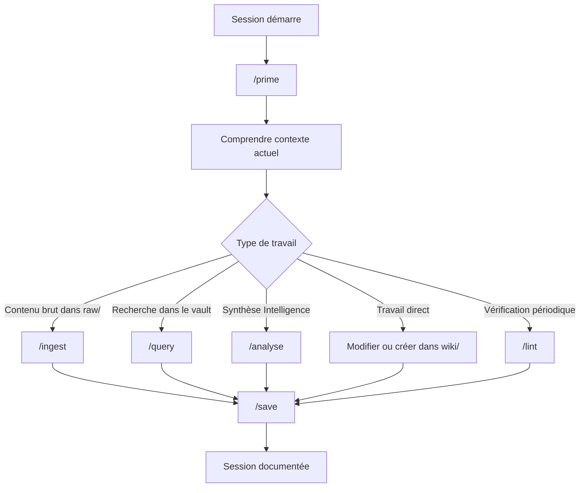

# 05 - Cycle de session

> **Résumé en une phrase** : Une session normale commence par `/prime`, choisit ensuite le bon workflow selon le besoin, puis se termine par `/save` pour synchroniser daily, index et log.

## Cycle standard

## `/prime`

Objectif : charger le contexte minimal sans scanner tout le vault.

Lit normalement :

- `CLAUDE.md` ou `AGENTS.md`
- `AIOS/Me.md`
- `AIOS/Vault Map.md`
- `AIOS/Skills Map.md`
- `wiki/index.md`
- la dernière daily note pertinente

Ne modifie rien.

## Travail direct

Le travail direct couvre :

- créer une note wiki ;
- enrichir une note existante ;
- documenter un projet ;
- ajouter une ressource ;
- mettre à jour une convention après validation.

Avant de créer une note, chercher si une note existante couvre déjà le sujet. Enrichir est préféré à dupliquer.

## `/query`

Objectif : répondre à une question à partir du wiki seulement.

Comportement attendu :

- commencer par `wiki/index.md` ;
- lire les notes pertinentes ;
- répondre en citant les notes utilisées ;
- ne pas écrire sans validation si la synthèse n'était pas demandée comme modification.

## `/save`

Objectif : conserver la trace de ce qui a été fait.

Modifie :

- `wiki/Daily/YYYY-MM-DD.md`
- `wiki/log.md`
- parfois `wiki/index.md` si de nouvelles notes existent

Règle : ne jamais supprimer du contenu d'une daily, seulement ajouter ou compléter.

## Liens typés

- fait-partie-de → [[Fonctionnement complet du vault Obsidian + AIOS]]
- soutient → [[AIOS/Skills Map]]
- soutient → [[Obsidian-Claude Code]]
- rédigé-par → humain+claude
