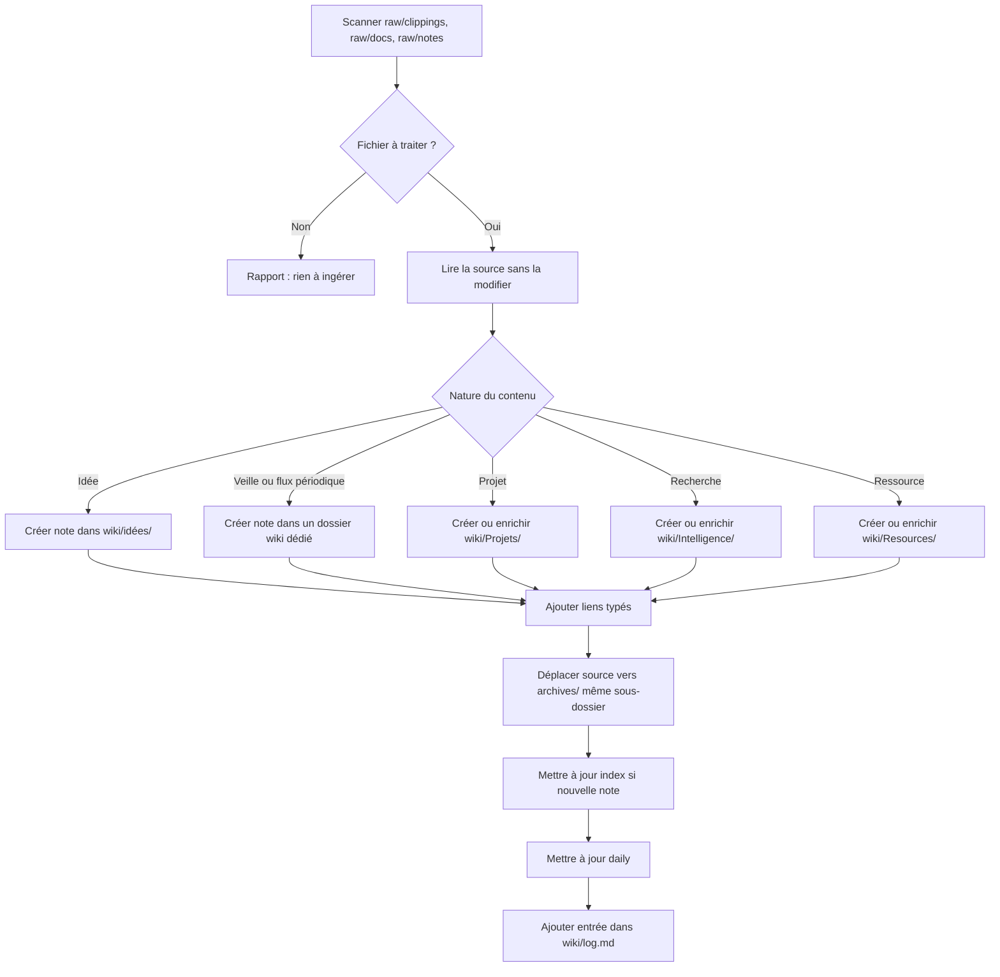
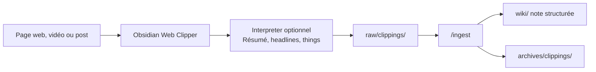

# 06 - Ingest raw vers wiki

> **Résumé en une phrase** : `/ingest` transforme les sources brutes de `raw/` en notes structurées dans `wiki/`, incluant `wiki/idées/`, puis déplace les sources traitées vers `archives/`.

## Principe

`/ingest` est le pont entre les captures brutes et la connaissance durable. Le contenu brut n'est pas édité : il est lu, synthétisé, lié, puis archivé.



## Étapes détaillées

1. Scanner `raw/clippings/`, `raw/docs/` et `raw/notes/`.
2. Ignorer les fichiers déjà traités si une note wiki active et traçable existe déjà.
3. Lire la source complète sans modifier le fichier.
4. Identifier les concepts, faits, décisions, idées et liens utiles.
5. Chercher une note existante à enrichir avant de créer une nouvelle note.
6. Créer ou enrichir la note dans le bon dossier.
7. Ajouter frontmatter, résumé en une phrase et liens typés.
8. Déplacer la source traitée vers `archives/<même-sous-dossier>/`.
9. Mettre à jour `wiki/index.md`, la daily et `wiki/log.md`.

## Capture web avec Obsidian Web Clipper

Obsidian Web Clipper est l'outil recommandé pour transformer une page web, une vidéo ou un post en Markdown propre avant ingestion. Il évite le copier-coller manuel, conserve les métadonnées utiles et donne à l'IA une source lisible plutôt qu'une page bruitée.



Configuration recommandée :

- destination par défaut : `raw/clippings/` ;
- conserver l'URL source et les métadonnées ;
- utiliser l'Interpreter si disponible pour pré-structurer le contenu ;
- garder l'article complet sous la synthèse quand c'est utile pour la traçabilité ;
- laisser `/ingest` décider de la note finale, du dossier wiki et des liens typés.

Le prompt Interpreter documenté dans [[Obsidian Web Clipper - Prompt Interpreter]] utilise trois couches : résumé rapide, headlines et things. C'est très utile pour décider vite si une source mérite d'être intégrée en profondeur.

## Cas spécial : idées

Si la source parle d'une idée, la destination est `wiki/idées/`.

Format :

```text
wiki/idées/(YYYY-MM-DD_HHhMM)-(nom-de-l-idee).md
```

La note doit inclure :

- l'idée en clair ;
- les projets reliés ;
- les autres idées reliées si elles existent ;
- un lien typé `dérivé-de` vers la source archivée.

## Cas spécial : veille ou flux périodique

Une automatisation externe doit seulement déposer un Markdown brut dans `raw/clippings/`. Elle ne doit pas écrire directement dans `wiki/`.

`/ingest` classe ensuite la veille ou le flux périodique dans le dossier wiki prévu par la convention du vault, par exemple :

```text
wiki/Veilles/YYYY/mois/
```

## Ce que `/ingest` ne fait pas

- Il ne modifie pas le texte dans `raw/`.
- Il ne copie pas une source entière sans synthèse.
- Il ne crée pas une note superficielle si le contenu n'ajoute rien.
- Il ne laisse pas une note sans lien typé.

## Liens typés

- fait-partie-de → [[Fonctionnement-complet-du-vault-Obsidian-AIOS]]
- soutient → [[AIOS/Vault Map]]
- soutient → [[AIOS/Skills Map]]
- lié-à → [[08-Skills-et-automatisations]]
- lié-à → [[Obsidian Web Clipper - Prompt Interpreter]]
- rédigé-par → humain+claude
