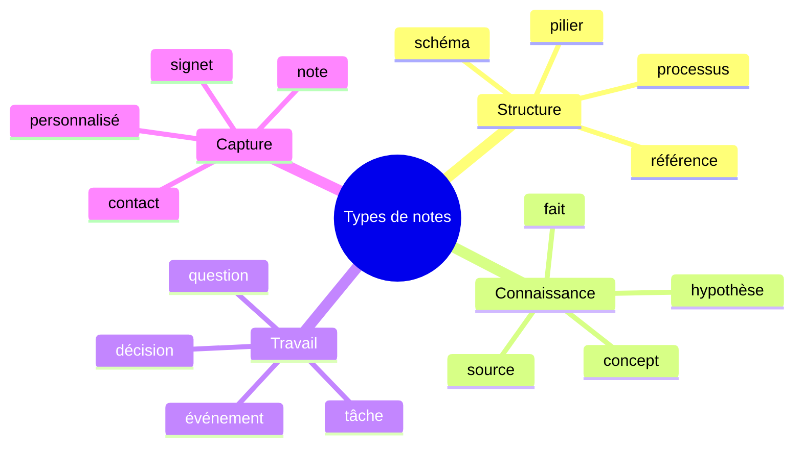
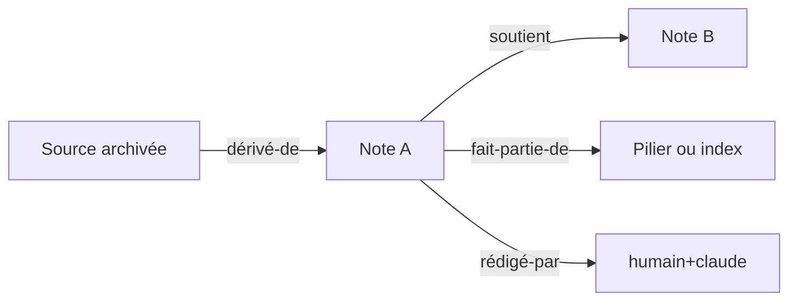

# 07 - Standards des notes Markdown

> **Résumé en une phrase** : Les notes durables du vault suivent le format Infinite Brain avec frontmatter, résumé en une phrase, contenu structuré, wikilinks, embeds, callouts, Mermaid et liens typés.

## Squelette standard

```markdown
---
date: YYYY-MM-DD
tags: [tag]
type: processus
status: active
source: archives/chemin/source.md
author: humain+claude
---

# Titre

> **Résumé en une phrase** : Synthèse courte qui permet à l'IA de décider si la note mérite d'être lue.

## Résumé

Contexte en 2-3 phrases.

## Sections de fond

Contenu structuré.

## Convention des liens typés

- fait-partie-de → [[Note parent]]
- dérivé-de → [[archives/source.md]]
- rédigé-par → humain+claude
```

## Types de notes

Le champ `type:` utilise les 16 types français documentés dans `AIOS/Note Types.md` :



## Liens typés

Les liens narratifs `[[Note]]` servent à la lecture humaine. Les liens typés en fin de note servent à la navigation IA.



Types d'arêtes autorisés :

- `soutient`
- `contredit`
- `dépend-de`
- `dérivé-de`
- `lié-à`
- `fait-partie-de`
- `précédé-par`
- `suivi-par`
- `rédigé-par`
- `catégorisé-par`

## Syntaxes Obsidian utiles

| Besoin | Syntaxe |
| --- | --- |
| Lien interne | `[[Nom de note]]` |
| Lien avec libellé | `[[Nom de note\|Libellé]]` |
| Embed complet | `![[Nom de note]]` |
| Embed de section | `![[Nom de note#Section]]` |
| Callout | `> [!note]` |
| Commentaire invisible | `%% commentaire %%` |
| Diagramme | bloc de code `mermaid` |

## Règles de qualité

- Une note durable doit pouvoir être comprise sans relire la source.
- Les notes trop longues doivent être découpées.
- Une note issue d'une source doit pointer vers l'archive.
- Un index liste et oriente ; il ne remplace pas les notes de fond.
- Les titres doivent être explicites et stables.

## Liens typés

- fait-partie-de → [[Fonctionnement complet du vault Obsidian + AIOS]]
- soutient → [[AIOS/Note Types]]
- soutient → [[AIOS/Edge Types]]
- soutient → [[Infinite Brain - Knowledge Graph optimisé pour l'IA]]
- rédigé-par → humain+claude
