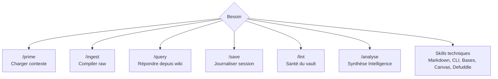

# 08 - Skills et automatisations

> **Résumé en une phrase** : Les skills sont des processus répétables qui indiquent à l'agent quoi lire, quoi modifier, quelles règles suivre et quel résultat produire.

## Rôle des skills

Un skill n'est pas seulement une commande. C'est une procédure encodée en Markdown : déclencheur, étapes, fichiers à lire, fichiers modifiables, règles et sortie attendue.

## Skills de workflow

| Skill | Déclencheur | Lit | Modifie |
| --- | --- | --- | --- |
| `/prime` | Début de session | `CLAUDE.md`, AIOS, index, daily | Rien |
| `/ingest` | Fichiers dans `raw/` | `raw/`, index, notes reliées | `wiki/`, `wiki/idées/`, `archives/`, index, daily, log |
| `/save` | Fin de session | Travail de session | daily, log, index si nécessaire |
| `/query` | Question sur le vault | index, notes pertinentes | Rien par défaut |
| `/lint` | Entretien périodique | toutes les notes wiki | Rapport, puis corrections seulement si demandé |
| `/analyse` | Plusieurs notes Intelligence à croiser | `wiki/Intelligence/` | notes `Analyse - ...`, index, daily, log |

## Skills techniques

| Skill | Usage |
| --- | --- |
| `obsidian-markdown` | Wikilinks, embeds, callouts, frontmatter, Mermaid |
| `obsidian-cli` | Interaction avec Obsidian ouvert, recherche, lecture, tâches |
| `obsidian-bases` | Création de vues `.base` |
| `json-canvas` | Création et modification de canvas Obsidian |
| `defuddle` | Extraction propre de pages web en Markdown |
| Serveur MCP ou connecteur externe | Création, validation ou exécution de workflows automatisés, selon le contexte du vault |

## Nice to have

> [!tip] Notes Rapides
> Un outil de notes rapides est très utile pour capturer une idée sans ralentir le travail. Dans ce kit, la règle importante n'est pas l'outil choisi, mais la destination : les captures brutes vont dans `raw/notes/`, puis `/ingest` les transforme en notes wiki, incluant les notes dans `wiki/idées/`.

> [!tip] Skill Kie.ai
> Un skill de génération d'images comme `kie-image` peut être ajouté si l'équipe produit des visuels pour posts, présentations ou contenus marketing. Il doit rester optionnel, documenter ses dépendances, et ne jamais exposer de clé API dans les notes.

## Automatisations implicites du vault

Certaines actions doivent être faites automatiquement par l'agent quand elles découlent du travail :

- Ajouter une nouvelle note à `wiki/index.md`.
- Ajouter une entrée à `wiki/log.md`.
- Mettre à jour ou créer la daily du jour.
- Ajouter `## Liens typés`.
- Mettre une source traitée dans `archives/` après `/ingest`.
- Signaler une information absente plutôt que l'inventer.

## Règles de prudence

- Ne pas utiliser un skill technique si un simple fichier Markdown suffit.
- Ne pas lancer d'automatisation externe sans objectif clair.
- Ne pas écrire de secrets dans une note.
- Ne pas réécrire des règles centrales sans validation explicite.

## Liens typés

- fait-partie-de → [[Fonctionnement-complet-du-vault-Obsidian-AIOS]]
- soutient → [[AIOS/Skills Map]]
- soutient → [[Claude Code - Super Skills et System Karpathy]]
- lié-à → [[09-Automatisations-externes-et-integrations]]
- lié-à → [[Obsidian Web Clipper - Internet en texte brut]]
- rédigé-par → humain+claude
