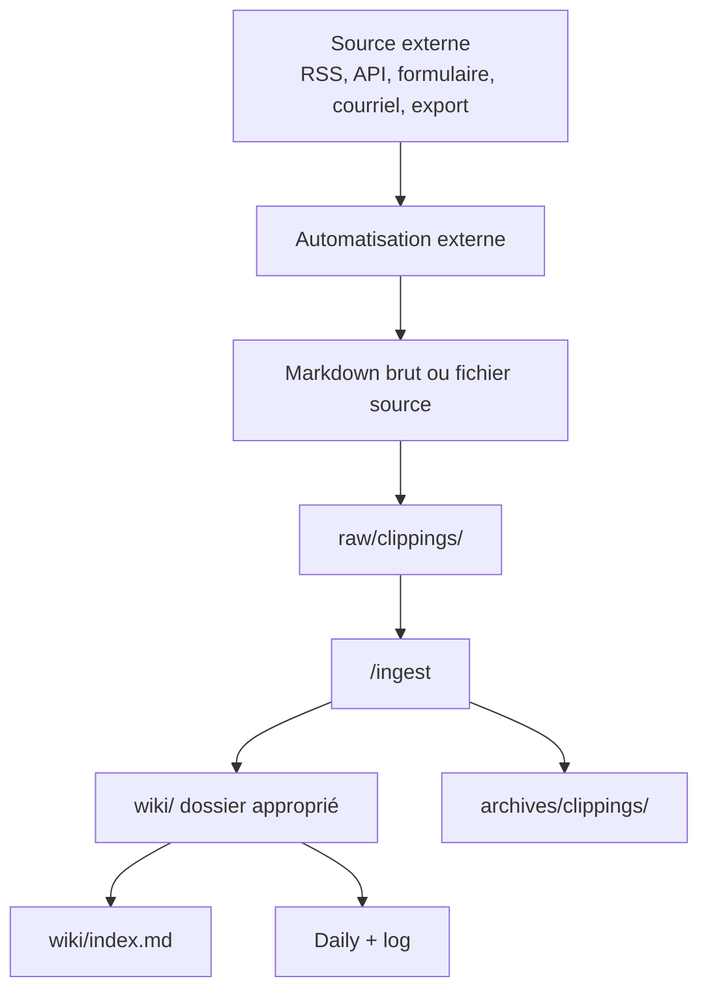

# 09 - Automatisations externes et intégrations

> **Résumé en une phrase** : Les automatisations externes peuvent alimenter le vault, mais elles doivent respecter la frontière `raw/` → `/ingest` → `wiki/`.

## Rôle des automatisations externes

Une automatisation externe sert à produire une source brute, déclencher une tâche répétable ou exposer un outil à un agent IA. Elle peut venir d'un outil no-code, d'un script local, d'un serveur MCP, d'un connecteur SaaS ou d'un service interne.

Dans ce kit, l'automatisation ne remplace pas `/ingest`. Elle alimente le vault en sources brutes.

Obsidian Web Clipper est l'intégration web la plus importante à prévoir dans une reproduction du kit : elle permet de capturer une source directement en Markdown propre, dans `raw/clippings/`, avec assez de métadonnées pour que `/ingest` puisse ensuite créer une note traçable.

## Flow recommandé

Règle importante : l'automatisation dépose dans `raw/` et rien de plus. Le classement, la synthèse, les liens et l'archivage appartiennent à `/ingest`.

## Serveur MCP ou connecteur IA

Un serveur MCP ou un connecteur peut permettre à l'agent de :

- lire ou déclencher des outils externes ;
- créer ou modifier un workflow ;
- tester une exécution ;
- récupérer des résultats structurés ;
- automatiser une tâche répétable.

Le vault peut documenter les outils disponibles dans un fichier de configuration AIOS, mais les secrets ne doivent jamais être écrits dans les notes.

## Sécurité

Pour un kit reproductible, documenter seulement :

- le rôle de l'intégration ;
- le type d'accès requis ;
- l'emplacement logique de la configuration ;
- les règles de rotation ou de révocation ;
- le fait que les secrets restent hors vault.

## Ce qui est interdit

- Écrire des tokens, clés API ou secrets dans `wiki/`.
- Faire écrire une automatisation directement dans `wiki/`.
- Laisser un outil externe décider seul du classement durable.
- Réactiver une URL temporaire ou fragile comme source durable sans le documenter.

## Liens typés

- fait-partie-de → [[Fonctionnement complet du vault Obsidian + AIOS]]
- soutient → [[AIOS/Codex Config]]
- soutient → [[06 - Ingest raw vers wiki]]
- soutient → [[08 - Skills et automatisations]]
- soutient → [[Obsidian Web Clipper - Internet en texte brut]]
- rédigé-par → humain+claude
