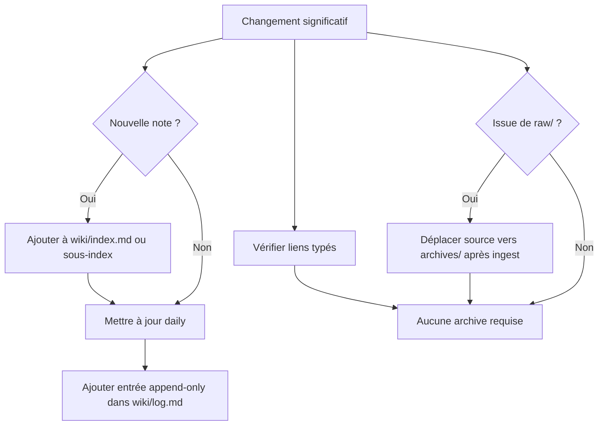

# 10 - Maintenance et choses automatiques

> **Résumé en une phrase** : La santé du vault repose sur une mise à jour automatique des index, daily notes, logs, liens typés et archives après chaque opération significative.

## Objets à maintenir



## `wiki/index.md`

Le master index sert à naviguer sans scanner tout le vault. Toute nouvelle note durable importante doit y être ajoutée dans la bonne section ou via un sous-index.

## `wiki/log.md`

Le log est append-only. Il sert à savoir ce qui a été fait, quand, et pourquoi.

Format recommandé :

```text
YYYY-MM-DD HH:MM — Action : résumé court
```

Ne pas réécrire l'historique sauf correction explicitement demandée.

## Daily notes

Les daily notes documentent les sessions. Elles doivent contenir :

- actions effectuées ;
- décisions prises ;
- problèmes rencontrés ;
- prochaines étapes si utiles ;
- liens vers les notes touchées.

Si la daily du jour n'existe pas, la créer au format Infinite Brain avec `type: événement`.

## Édition Obsidian vs écriture structurée

Obsidian ne doit pas être utilisé comme outil principal pour modifier directement les notes structurées dans `wiki/`. Il sert à lire, visualiser, naviguer, valider le rendu et capturer des entrées brutes dans `raw/`.

Toute création, modification, déplacement, enrichissement ou restructuration dans la mémoire numérique structurée doit passer par l'agent IA. C'est lui qui maintient :

- `wiki/index.md` ;
- `wiki/log.md` ;
- `wiki/Daily/YYYY-MM-DD.md` ;
- les liens typés ;
- le frontmatter ;
- la traçabilité source vers `archives/`.

Si une modification d'urgence est faite directement dans `wiki/` avec Obsidian, elle doit être signalée à l'agent IA dès que possible. L'agent doit alors régulariser la note touchée et mettre à jour daily, log, index, liens typés et traçabilité si nécessaire.

Règle courte : **Obsidian écrit dans les zones d'entrée ; l'agent IA écrit dans la mémoire numérique structurée.**

## `/lint`

Le lint vérifie :

- notes orphelines ;
- liens cassés ;
- notes absentes de l'index ;
- frontmatter incomplet ;
- taille excessive de l'index ;
- incohérences de statut.

Le lint propose les corrections ; il ne supprime jamais une note.

## Fréquence d'entretien

| Action | Fréquence |
| --- | --- |
| `/prime` | Début de session |
| `/save` | Fin de session ou pause majeure |
| `/ingest` | Dès que `raw/` contient des sources à traiter |
| `/analyse` | Après plusieurs nouvelles notes Intelligence |
| `/lint` | Environ 1x/semaine ou après gros lot de notes |

## Liens typés

- fait-partie-de → [[Fonctionnement complet du vault Obsidian + AIOS]]
- soutient → [[AIOS/Skills Map]]
- soutient → [[AIOS/Vault Map]]
- rédigé-par → humain+claude
