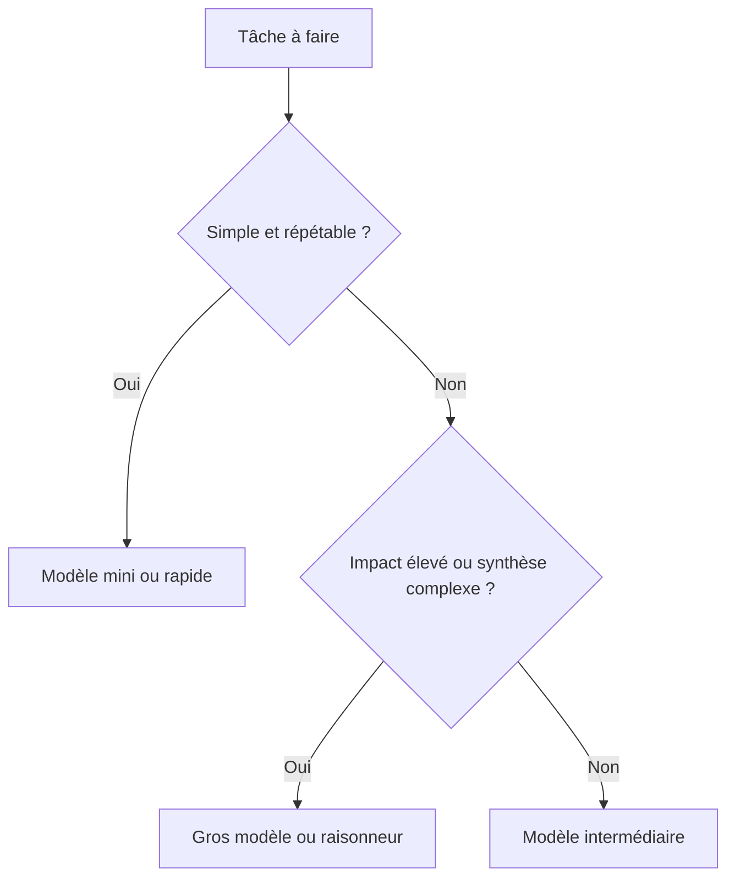

# 12 - Choix des modèles IA

> **Résumé en une phrase** : Le choix du modèle IA équilibre qualité, coût, quotas et complexité opérationnelle selon la tâche à faire dans la mémoire numérique.

## Principe général

Plus un modèle est récent, gros ou spécialisé en raisonnement, plus il est souvent performant pour comprendre un contexte complexe. Mais il coûte généralement plus cher en tokens, consomme davantage de quota et peut atteindre plus vite les limites d'un abonnement.

Le bon réflexe n'est pas d'utiliser le plus gros modèle pour tout. Il faut choisir le modèle selon le niveau de risque et de complexité.

## Petits modèles ou modèles mini

À privilégier pour :

- `/prime` ;
- `/save` ;
- `/ingest` simple ;
- classement de notes ;
- correction de frontmatter ;
- petites mises à jour d'index ;
- reformulations simples ;
- vérifications mécaniques.

Ces tâches demandent de la discipline, mais pas toujours le modèle le plus puissant.

## Gros modèles ou modèles raisonneurs

À privilégier pour :

- architecture du vault ;
- synthèses complexes ;
- refonte de notes critiques ;
- arbitrage entre plusieurs conventions ;
- décisions importantes ;
- analyse de sources nombreuses ou contradictoires ;
- création d'un nouveau workflow de travail.

## Quotas et coûts

Il est normal d'atteindre parfois les limites d'un abonnement si la mémoire est utilisée intensivement. Les agents relisent du contexte, inspectent des notes et produisent des synthèses : tout cela consomme des tokens.

Quand les limites approchent :

- réduire le contexte ;
- travailler par petites tâches ;
- utiliser un modèle mini ;
- changer temporairement d'outil IA ;
- reporter les gros travaux ;
- utiliser `wiki/index.md` plutôt que lire tout le vault.

Source : [OpenAI — Pricing](https://platform.openai.com/docs/pricing/)

## IA locale ou contrôlée

Il est possible d'utiliser de l'IA locale ou contrôlée dans le nuage avec des outils comme Ollama, OpenCode ou d'autres runtimes. Cela peut aider pour la confidentialité, le contrôle des coûts ou l'indépendance vis-à-vis d'un fournisseur.

Mais cette option est plus complexe :

- installation et mises à jour ;
- choix du modèle ;
- performance matérielle ;
- configuration réseau ;
- surveillance ;
- sécurité ;
- qualité parfois inférieure aux meilleurs modèles cloud.

Source : [Ollama docs](https://docs.ollama.com/)

## Règle pratique

Utiliser petit par défaut, gros quand l'enjeu le justifie.

## Liens typés

- fait-partie-de → [[Fonctionnement-complet-du-vault-Obsidian-AIOS]]
- soutient → [[01-Requis]]
- soutient → [[Claude Code - Optimisation Contexte]]
- rédigé-par → humain+claude
