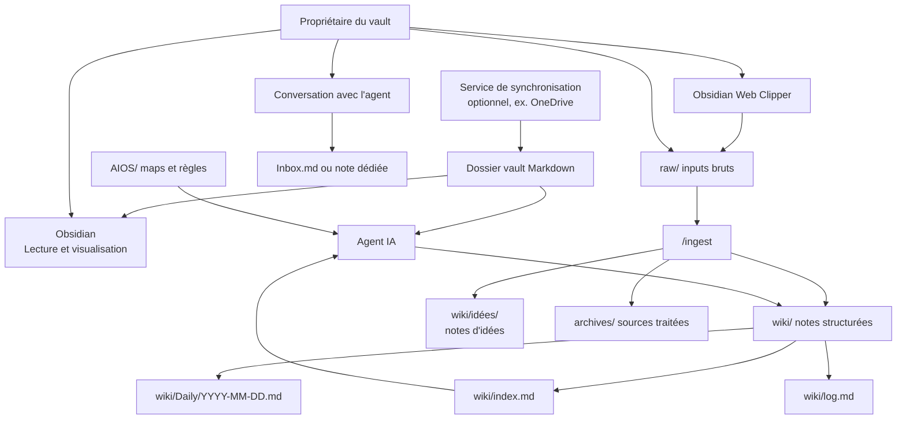
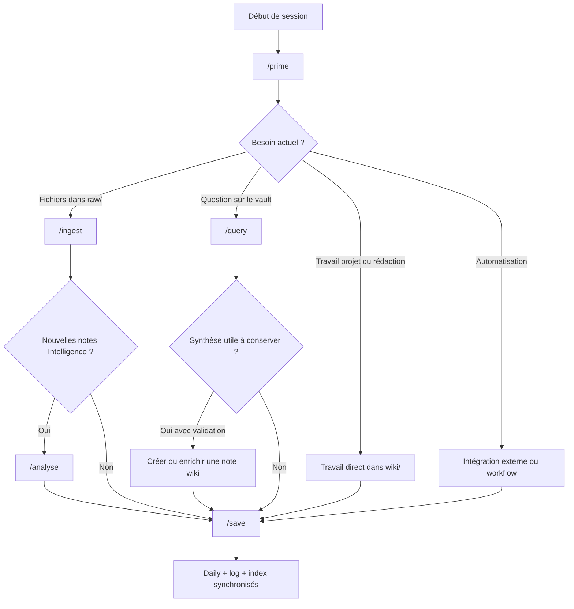

# Fonctionnement complet du vault Obsidian + AIOS

> **Résumé en une phrase** : Manuel central d'un vault Obsidian + AIOS, reliant les règles de travail, la structure `raw/wiki/archives`, les skills, les notes Markdown et les automatisations.

## Rôle de cette note

Cette note est le point d'entrée unique pour comprendre comment travailler dans ce type de vault sans historique de conversation. Elle ne remplace pas `CLAUDE.md`, `AGENTS.md` ni `AIOS/`; elle les synthétise en un manuel opératoire lisible par un propriétaire de vault et par un agent IA.

Cette mémoire est puissante, mais elle a un coût en tokens et demande une stratégie de sauvegarde.

À lire dans cet ordre :

1. Cette note maîtresse.
2. `00-Description-de-la-memoire-numerique`, pour comprendre le concept.
3. `01-Requis`, pour installer le minimum nécessaire.
4. `02-Comment-mettre-en-place-votre-memoire-numerique`, pour laisser l'IA configurer et tester le kit.
5. Les notes de fonctionnement ci-dessous.
6. Les fichiers sources si une règle doit être vérifiée : `CLAUDE.md`, `AGENTS.md`, `AIOS/Vault Map.md`, `AIOS/Skills Map.md`.

## Vue d'ensemble

## Règles pour l'utilisateur

- Utiliser Obsidian pour lire, visualiser, naviguer, rechercher et valider le rendu des notes.
- Utiliser Obsidian pour capturer ou modifier des notes d'entrée dans les zones prévues pour l'ingestion, comme `raw/notes/` et `raw/clippings/`.
- Ne pas utiliser Obsidian comme outil principal pour modifier directement les notes structurées dans `wiki/`.
- Passer par l'agent IA pour toute écriture structurée dans la mémoire numérique : création, enrichissement, déplacement, restructuration, archivage ou mise à jour d'index.

## Règles pour l'agent IA

- Lire AIOS et `wiki/index.md` avant de travailler dans la mémoire numérique.
- Maintenir ensemble les notes, les liens typés, `wiki/index.md`, `wiki/log.md`, la daily note et la traçabilité vers `archives/`.
- Ne jamais modifier le contenu d'un fichier dans `raw/`.
- Après un `/ingest` réussi, déplacer la source traitée de `raw/` vers `archives/`.
- Ne jamais supprimer une note wiki : archiver avec `status: archive`.
- Ne jamais inventer une information absente du vault.
- Capturer les idées échangées en conversation dans `Inbox.md` ou une note dédiée.

## Règles pour les outils externes

- Un service de synchronisation peut synchroniser le dossier du vault ; il ne décide pas de la structure de connaissance.
- Obsidian Web Clipper et les automatisations externes déposent des sources dans `raw/`.
- Les outils externes ne doivent pas écrire directement dans `wiki/`, sauf exception explicitement conçue et documentée.
- Les secrets, clés API et jetons d'accès restent hors vault.

## Principe clé

Obsidian écrit dans les zones d'entrée. L'agent IA écrit dans la mémoire numérique structurée.

Cette séparation garde la mémoire numérique cohérente : liens, types, journaux, index, sources et archives restent synchronisés.

## Carte des notes du manuel

![[00-Description-de-la-memoire-numerique]]

![[01-Requis]]

![[02-Comment-mettre-en-place-votre-memoire-numerique]]

![[03-Architecture-du-vault]]

![[04-AIOS-et-regles-de-fonctionnement]]

![[05-Cycle-de-session]]

![[06-Ingest-raw-vers-wiki]]

![[07-Standards-des-notes-Markdown]]

![[08-Skills-et-automatisations]]

![[09-Automatisations-externes-et-integrations]]

![[10-Maintenance-et-choses-automatiques]]

![[11-Entretien-de-la-memoire-numerique]]

![[12-Choix-des-modeles-IA]]

![[13-Comment-bien-utiliser-la-memoire-numerique]]

## Flow décisionnel complet

## Ce qu'il faut retenir

- `AIOS/` est le manuel portable pour un agent IA : qui est le propriétaire du vault, comment naviguer, quels processus utiliser.
- `wiki/` est l'espace structuré et maintenu.
- `raw/` est l'espace d'entrée humain, lu mais non modifié.
- `archives/` conserve les sources traitées.
- Obsidian est l'interface de lecture, de navigation et de capture brute.
- Un service de synchronisation, comme OneDrive, peut synchroniser le vault entre les appareils.
- L'agent IA est l'interface d'écriture structurée de la mémoire numérique.
- Obsidian Web Clipper est l'outil recommandé pour capturer le web en Markdown propre avant `/ingest`.
- Un service de synchronisation est optionnel, mais fortement utile pour travailler sur plusieurs appareils.
- Au moins un outil IA est requis pour maintenir la mémoire structurée.
- Les modèles IA doivent être choisis selon la tâche : petit pour le routinier, gros pour le complexe.
- Les skills sont des workflows répétables, pas des suggestions vagues.
- Les notes wiki doivent être atomiques, typées, liées et traçables.

## Liens typés

- fait-partie-de → [[Resources/index]]
- soutient → [[AIOS/Vault Map]]
- soutient → [[AIOS/Skills Map]]
- soutient → [[Obsidian-Claude Code]]
- soutient → [[Obsidian Web Clipper - Internet en texte brut]]
- soutient → [[Infinite Brain - Knowledge Graph optimisé pour l'IA]]
- soutient → [[00-Description-de-la-memoire-numerique]]
- soutient → [[01-Requis]]
- soutient → [[02-Comment-mettre-en-place-votre-memoire-numerique]]
- soutient → [[11-Entretien-de-la-memoire-numerique]]
- rédigé-par → humain+claude
